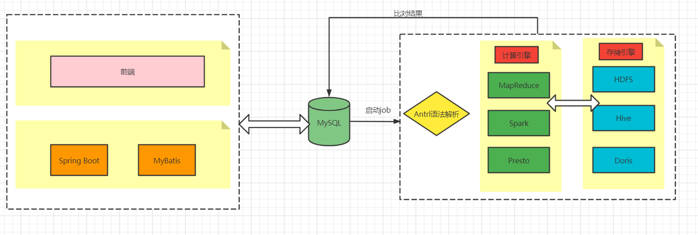
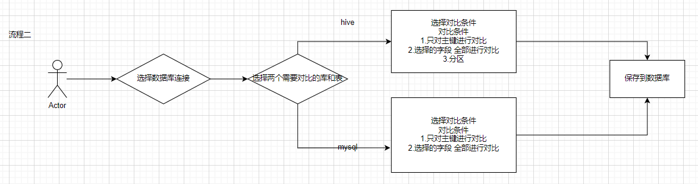
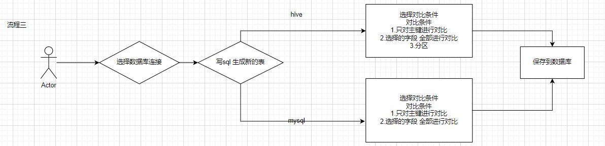
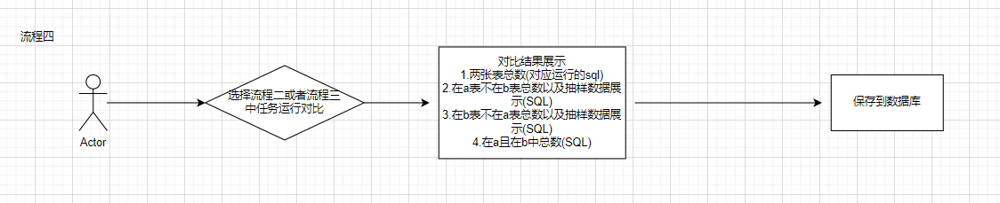
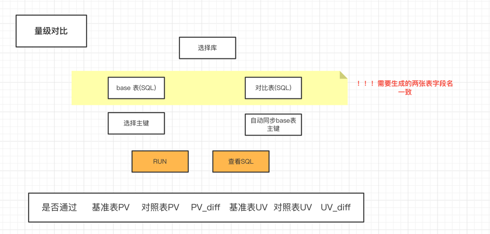
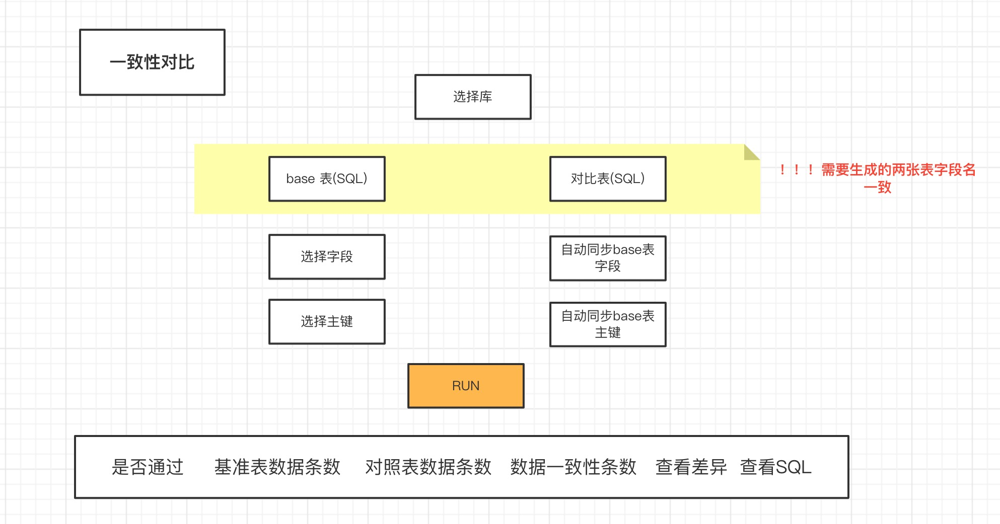

# dataCompare

#### 介绍
dataCompare 是一个数据库比对工具：支持hive表数据比对，mysql、Doris 数据比对，实现自动化配置进行数据比对，避免频繁写sql 进行处理，后续考虑支持ck等等

#### 功能介绍
(1)低代码配置，即可实现数据表的对比，不需要繁琐的sql开发

(2)目前已经支持如下功能： 量级对比、一致性对比、差异case 发现，已经支持MySQL、Hive、Doris

(3)后续计划支持：陌生表指针探测，包括：枚举值探测、范围值探测、主键id hash 探测

#### 软件架构

技术栈:

后端：Spring boot + Mybatis

数据库:MySQL

解析引擎：Antrl

数据存储引擎、计算引擎：Hive、Spark 等

#### 系统流程图

#### 系统功能演示
系统主页

数据库配置

mysql配置

hive配置

job配置

对比结果展示

#### 系统运行
系统运行环境要求：

java jdk8

mysql 5.7.36

运行配置

(1)将sql目录中的sql文件进行运行在数据库，创建库和表

(2)下载发布好的jar(https://github.com/zhugezifang/dataCompare/releases) 或者自己构建jar

(3)修改数据库配置信息 application.yml，将数据库连接信息改为步骤(1)的数据库连接信息

(4)运行 java -jar -Dspring.config.location=application.yml dataCompare.jar (application.yml和jar在同一目录下)

(5)访问 http://127.0.0.1/ 即可 (账号:admin 密码:admin123)

环境安装配置

(1)如果要实现Hive数据对比配置需要先安装Hive 环境(安装文档参考docker快速安装Hive环境：https://blog.csdn.net/ifenggege/article/details/107860477)

(2)安装好之后新建数据源连接时选择Hive，地址为：jdbc:hive2://ip:10000 

#### 技术交流

#### 致谢
感谢ruoyi 提供前端服务
