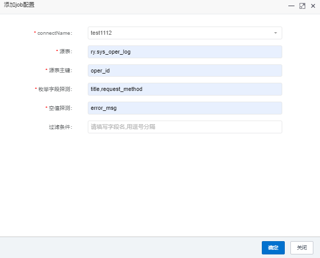
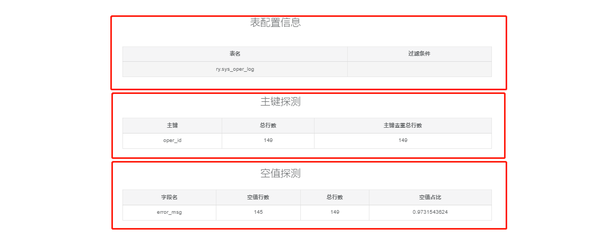
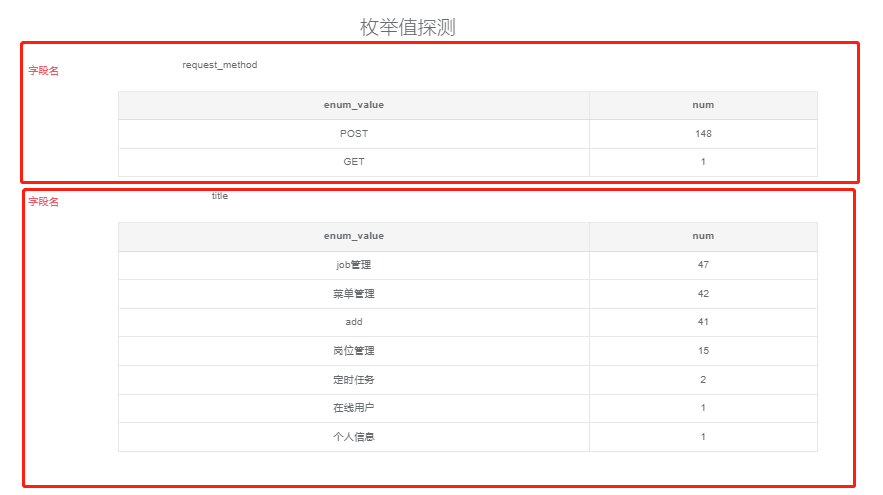

# dataCompare

#### Introduction
dataCompare is a database comparison and profiling platform

(1)support Hive table data comparison, MySQL、Doris data comparison, realize automatic configuration for data comparison, avoid frequent SQL writing for processing

(2)support easy configuration for data profiling

#### Features

data-compare

(1)Interface-level interactive data comparison task configuration, low code and small amount of configuration to quickly generate comparison tasks

(2)Magnitude comparison, consistency comparison, automatic difference case discovery

(3)JDBC databases such as MySQL, Apache Hive, and Apache Doris are currently supported

(4)Already supports the comparison results to automatically send email alarm reports

data-profiling

(1)Data detection can be completed with low code and a small amount of configuration

(2)Primary key, enumeration value, null value detection

#### Software Architecture

Technology stack:

End：Spring boot + Mybatis

DataBase:MySQL

Parsing Engine：Antrl

Big Data：Hive、Spark

#### System flowchart

#### Demonstration of system functionality
Home

data-compare:

DbConfig

mysql config

hive config

job config

Comparison results are displayed

data-profiling:

job config

profiling result

#### The system running environment

java jdk8

mysql 5.7.36

Runing config

(1)Run the SQL files in the SQL directory in the database, create database and tables

(2)build jar using the source code of the project: mvn clean package -Dmaven.test.skip=true -Ptest

(3)edit database config information of application.yml

(4)run java -jar -Dspring.config.location=application.yml dataCompare.jar (application.yml and jar must in the same directory)

(5)visit http://127.0.0.1/ (UserName:admin PassWord:admin123)

Environment installation configuration

(1)If you want to implement Hive data comparison configuration, you need to install the Hive environment first(The installation documentation refers to the docker quick installation of the Hive environment：https://blog.csdn.net/ifenggege/article/details/107860477)

(2)After installation, when creating a new data source connection, select Hive at the address jdbc:hive2://ip:10000

#### Technological Communication

#### Star History

#### Thanks
Thanks ruoyi Provides front-end services
