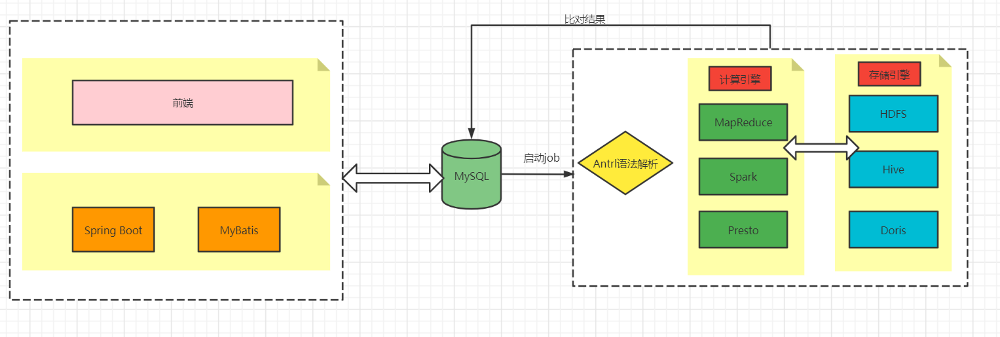
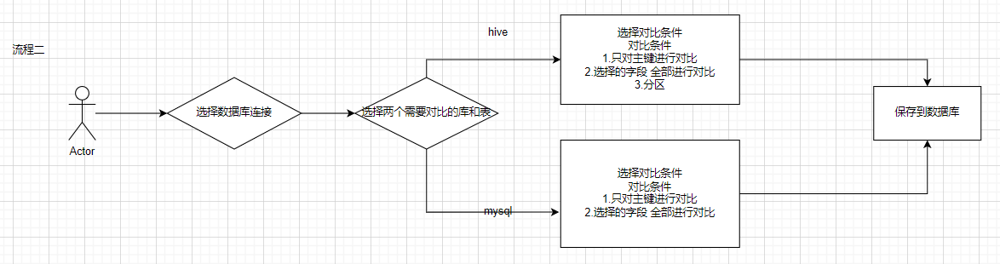
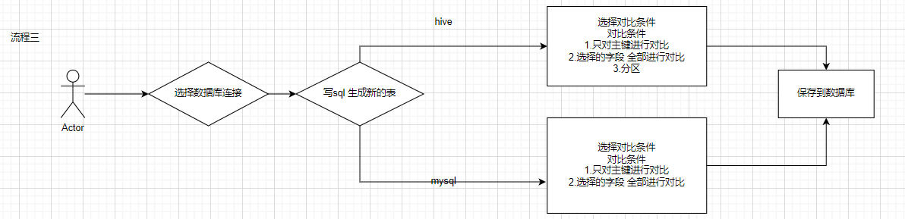

# dataCompare

#### 介绍
dataCompare 是一个数据库比对工具：支持hive表数据比对，mysql 数据比对，实现自动化配置进行数据比对，避免频繁写sql 进行处理，后续考虑支持doris、ck等等

#### 软件架构

技术栈:

后端：Spring boot + Mybatis

数据库:MySQL

解析引擎：Antrl

数据存储引擎、计算引擎：Hive、Spark 等

#### 系统流程图

#### 系统功能演示
系统主页

数据库配置

job配置

对比结果展示

#### 系统运行
系统运行环境要求：

java jdk8

mysql 5.7.36

运行配置

(1)将sql目录中的sql文件进行运行在数据库，创建库和表

(2)下载发布好的jar(https://github.com/zhugezifang/dataCompare/releases)或者自己构建jar

(3)修改数据库配置信息 application.yml

(4)运行 java -jar -Dspring.config.location=application.yml dataCompare.jar (application.yml和jar在同一目录下)

(5)访问 http://127.0.0.1/ 即可

#### 技术交流

#### 致谢
感谢ruoyi 提供前端服务