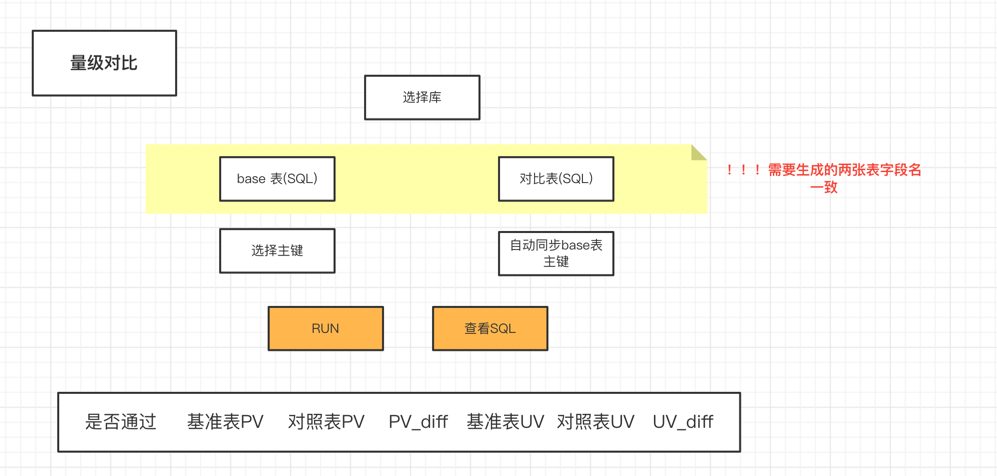
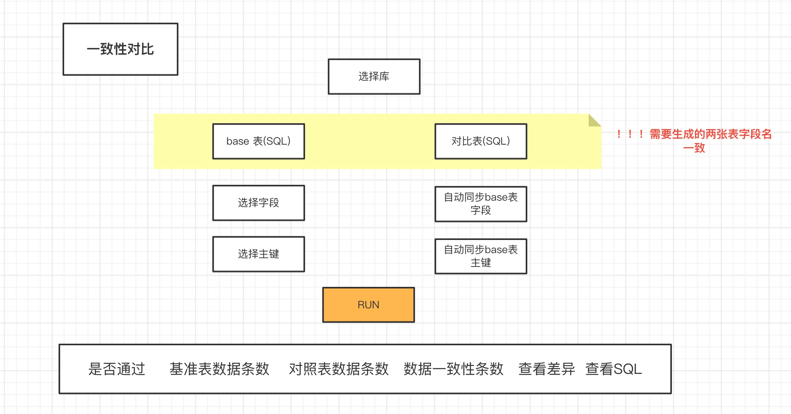

# dataCompare

#### 介绍
dataCompare 是一个数据库比对工具：支持hive表数据比对，mysql 数据比对，实现自动化配置进行数据比对，避免频繁写sql 进行处理，后续考虑支持doris、ck等等

#### 软件架构

技术栈:

后端：Spring boot + Mybatis 

数据库:MySQL 

解析引擎：Antrl 

数据存储引擎、计算引擎：Hive、Spark 等 

#### 系统功能

#### 技术交流

选择主键
选择对比字段

一、量级对比
是否通过	基准表PV	对照表PV	PV_diff	基准表UV	对照表UV	UV_diff
是	    100000	100000	    0	    100000	100000	    0
//选主键

select
base.pv,
verify.pv as verify_pv,
base.pv - verify.pv as diff_pv,
base.uv,
verify.uv as verify_uv,
base.uv - verify.uv as diff_uv
from(
select 'total_num'
as name,
count(1) as pv,
count(distinct id) as uv from a
) base
left outer join(
select 'total_num'
as name,
count(1) as pv,
count(distinct id) as uv from b
) verify
on base.name = verify.name

2.一致性比对

是否通过	基准表数据条数	对照表数据条数	一致数据条数
是	        100000	      100000	    100000
select
sum(case when base.record_key is not null or base.record_key !='' then 1 else 0 end) as base_num,
sum(case when verify.record_key is not null or verify.record_key !='' then 1 else 0 end) as verify_num,
sum(case when base.record_key = verify.record_key then 1 else 0 end) as base_verify_equal_num
from (
select
md5(concat(if(id is null, '-', id), if(user_name is null, '-', user_name), if(age is null, '-', age))) as record_key
from a
)base
full outer join (
select
md5(concat(if(id is null, '-', id), if(user_name is null, '-', user_name), if(age is null, '-', age))) as record_key
from b
)verify
on base.record_key=verify.record_key;

3.差异case发现

select base.dt as base_dt,
base.id as base_id,
base.age as base_age,
verify.age as verify_age,
case when if(base.age is null, '-',base.age) = if(verify.age is null, '-', verify.age) then '1'
else '0'
end as age_is_pass,
base.name as base_name,
verify.name as verify_name,
case when if(base.name is null, '-',base.name) = if(verify.name is null, '-', verify.name) then '1'
else '0'
end as name_is_pass,
base.sex as base_sex,
verify.sex as verify_sex,
case when if(base.sex is null, '-',base.sex) = if(verify.sex is null, '-', verify.sex) then '1'
else '0'
end as sex_is_pass
from (
select
id,
age,
name,
sex
from a
)base
full outer join (
select
id,
age,
name,
sex
from b
)verify
on if(base.id is null, '-', base.id) = if(verify.id is null, '-', verify.id)
where if(base.age is null, '-', base.age) <> if(verify.age is null, '-', verify.age)
or if(base.name is null, '-', base.name) <> if(verify.name is null, '-', verify.name)
or if(base.sex is null, '-', base.sex) <> if(verify.sex is null, '-', verify.sex)

参考:https://blog.csdn.net/aijiudu/article/details/115520101

#### 代码开发规范
1.  code header 参考:https://www.likecs.com/show-306082982.html
2.  Commit规范:
- feat：新功能（feature）
- fix：修补bug
- docs：文档（documentation）
- style： 格式变更（如格式化，不影响代码运行）
- refactor：重构（即不是新增功能，也不是修改bug的代码变动）
- perf：性能优化
- test：增加测试
- build：影响编译以及外部依赖的变更（例如pom）
- ci：CI配置文件/脚本变更
- chore：其他变更（不影响src或者test的文件）
- revert：回滚commit
例如:
  feat:add database
  fix:修复xxx异常以及参数解析问题

