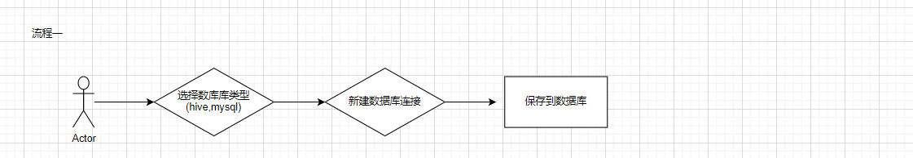

# dataCompare

#### Introduction
dataCompare is a database comparison platform: support Hive table data comparison, MySQL、Doris data comparison, realize automatic configuration for data comparison, avoid frequent SQL writing for processing, and consider supporting CK and so on

#### Features
(1)Low-code configuration can realize the comparison of data tables without cumbersome sql development

(2)The following functions are currently supported: magnitude comparison, consistency comparison, difference case discovery, MySQL、Hive and Doris haved already supported

(3)Subsequent plan support: unfamiliar table pointer detection, including: enumeration value detection, range value detection, primary key id hash detection

#### Software Architecture

Technology stack:

End：Spring boot + Mybatis

DataBase:MySQL

Parsing Engine：Antrl

Big Data：Hive、Spark

#### System flowchart

#### Demonstration of system functionality
Home

DbConfig

mysql config

hive config

job config

Comparison results are displayed

#### The system running environment

java jdk8

mysql 5.7.36

Runing config

(1)Run the SQL files in the SQL directory in the database, create database and tables

(2)download the release jar(https://github.com/zhugezifang/dataCompare/releases) or build jar using the source code of the project

(3)edit database config information of application.yml

(4)run java -jar -Dspring.config.location=application.yml dataCompare.jar (application.yml and jar must in the same directory)

(5)visit http://127.0.0.1/ (UserName:admin PassWord:admin123)

Environment installation configuration

(1)If you want to implement Hive data comparison configuration, you need to install the Hive environment first(The installation documentation refers to the docker quick installation of the Hive environment：https://blog.csdn.net/ifenggege/article/details/107860477)

(2)After installation, when creating a new data source connection, select Hive at the address jdbc:hive2://ip:10000

#### Technological Communication

#### Thanks
Thanks ruoyi Provides front-end services
